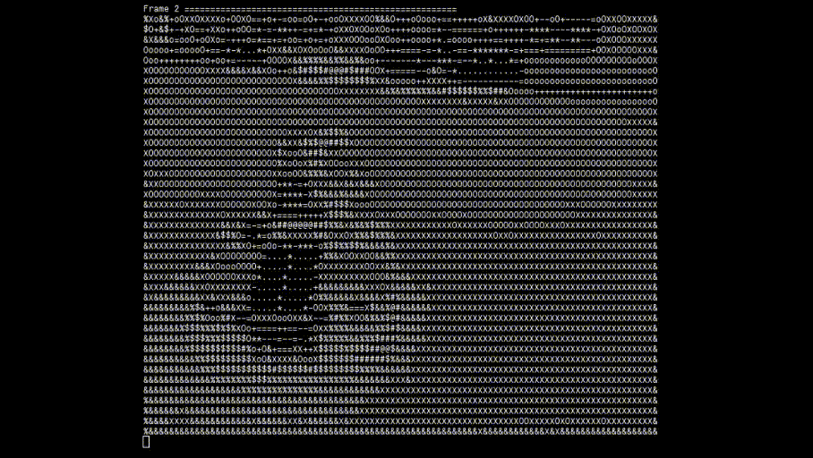

## img2ascii
transformar arquivos .png e .gif em ASCII.

todo:
- usar ncurses para imprimir ascii na sequência
- free em alguns pontos bem específicos
- refatorar em mais funções
- retomar o suporte a .png (retirado para testes)

status:
- em desenvolvimento
- sobre vazamento:

```
HEAP SUMMARY:
    in use at exit: 0 bytes in 0 blocks
  total heap usage: 1,994 allocs, 1,994 frees, 16,313,547,586 bytes allocated

All heap blocks were freed -- no leaks are possible
```

compile e teste o programa:
```
chmod +x sh
./sh
./img2ascii [N] [FILE.gif]
```

exemplo:

<p float="left">
  
   
</p>
